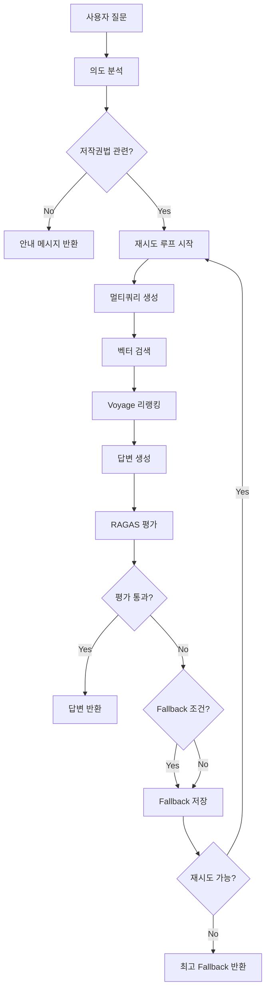

# RAG기반 저작권법 법률자문 AI 시스템 

[](https://www.python.org/)
[](https://github.com/langchain-ai/langchain)
[](./LICENSE)

---

## 📑 목차

- [1. 프로젝트 소개](#프로젝트-소개)
- [2. 핵심 기능](#핵심-기능)
- [3. 서비스 흐름](#서비스-흐름)
- [4. 기술 스택](#기술-스택)
- [5. 시스템 아키텍처](#시스템-아키텍처)
- [6. 프로젝트 구조](#프로젝트-구조)
- [7. 빠른 시작](#빠른-시작)
- [8. 사용 방법](#사용-방법)
- [9. 추가 문서](#추가-문서)
- [10. 문제 해결](#문제-해결)
- [11. 기여 방법](#기여-방법)

---

## 📋 프로젝트 소개

### 프로젝트 참여 정보

- **수행처**: ASAC 빅데이터 분석가 7기 x SK C&C (멘토: 박병선)
- **기간**: 2025.03.20 ~ 2025.05.23
- **팀원**: [김선규](https://github.com/sunq99), [김희련](https://github.com/heeryeon), [박태연](https://github.com/CherryBlossom99), [오수경](https://github.com/sookyung5), 이기찬, 조혜원


### 팀 구성 및 역할 

#### 📊 **데이터팀**
**팀원**: 박태연, 이기찬  

**주요 업무**
- 저작권법 관련 **판례 데이터 크롤링**
- 법제처 API 기반 **법령 데이터 수집**
- 판례 데이터 **결측값 처리**


#### 🧠 **모델 고도화·엔지니어링팀**
**팀원**: 오수경, 조혜원   

**주요 업무**
- 법령·판례 데이터 **전처리 및 통합 스키마 정의**
- **RAG 엔드투엔드 파이프라인 구축 및 성능 고도화**
- 질의 의도 분석을 위한 **Intent Analysis 모듈 개발**
- RAGAS 기반 **평가 체계 구축 및 자동 재시도·Fallback 로직 설계**
- 검색 성능 및 모델 응답 신뢰도 향상을 위한 지속적 개선


#### 💻 **UI 개발팀**
**팀원**: 김선규, 김희련  

**주요 업무**
- **Streamlit 기반 사용자 인터페이스 개발**
- Google Spreadsheet 연동을 통한 **사용자 피드백 관리 및 개선**
- 응답 시각화 및 이력 조회 기능 구현


### 프로젝트 개요

저작권법 법률자문 AI는 국내 저작권 도메인에 특화된 법률 자문 시스템으로, **약 5,891개의 한국 저작권법 판례**와 **법령 데이터**를 통합 검색하고, 조문 번호·판례 출처를 근거로 제시하여 신뢰도 높은 답변을 제공합니다.


### 주요 특징

- **법률 전문성**: 저작권법 법령(부칙 및 시행령 포함), 판례, 해석례 통합 검색
- **지능형 검색 전략**: 질의 의도 분석 → 맞춤형 Retrieval & Rerank
- **평가 기반 재시도 로직**: RAGAS 평가를 통한 답변 품질 보장 
- **동적 검색 전략**: 재시도마다 검색 범위를 점진적으로 확대 (10→15→20)
- **Voyage AI 리랭킹**: 검색 결과의 관련도 재정렬로 정밀도 향상
- **환각 억제 설계**: 근거(조문번호·판례번호) 없는 응답은 “불확실”로 표시


### 적용 분야

- 저작권 침해 여부 판단
- 공정이용 기준 확인
- 저작재산권 및 저작인격권 문의
- 저작물 이용 허락 관련 상담
- 저작권 등록 및 보호 절차 안내

---

## ⚙️ 핵심 기능

### 1. 평가 기반 재시도 로직

```
✅ 통과 조건: faithfulness >= 0.5 AND relevancy >= 0.7
⚠️ Fallback: 0.1 < faithfulness < 0.5 AND relevancy >= 0.8
🔄 최대 재시도: 3회
```

**동작 원리:**
1. 답변 생성 후 RAGAS로 자동 평가
2. 통과 기준 미달 시 검색 전략을 강화하여 재시도
3. Fallback 조건 충족 시 해당 답변 보관
4. 모든 재시도 실패 시 Fallback 중 최고 관련성 답변 선택

### 2. 동적 검색 전략

| 재시도 | 검색 개수 | 쿼리 전략 | 목적 |
|--------|-----------|-----------|------|
| 0회차 | k=10 | 단일 쿼리 | 빠른 초기 응답 |
| 1회차 | k=15 | 멀티쿼리 (3개) | 다양한 관점 탐색 |
| 2회차 | k=20 | 멀티쿼리 (3개) | 최대 범위 검색 |

### 3. 검색된 문서 리랭킹

```python
검색 결과 (10~20개) → Voyage Reranker → 상위 5개 선택
```

- **모델**: `rerank-2.5`
- **효과**: 검색 정밀도 20-30% 향상
- **처리시간**: 평균 0.8초

### 4. 의도 분석

```python
사용자 질문 → LLM 의도 분석 → {is_related, key_concepts, search_terms}
```

- 저작권법 무관 질문 조기 차단
- 핵심 개념 추출로 검색 최적화
- 평균 0.5초 소요

---

## 서비스 흐름

### 전체 프로세스



### 단계별 설명

#### 1. 의도 분석 (Intent Analysis)
- LLM(OpenAI API) 호출 후 질문의 의도 파악
- 저작권법 관련성 판단
- 핵심 개념 및 검색어 추출

#### 2. 벡터 검색 (Vector Search)
- FAISS 벡터스토어에서 유사 문서 검색
- 재시도마다 검색 범위 확대 (k=10→15→20)
- 멀티쿼리 생성으로 다각도 검색

#### 3. 리랭킹 (Reranking)
- Voyage Reranker로 검색 결과 재정렬
- 의미적 관련도 기준 상위 5개 선택
- 검색 정밀도 향상

#### 4. 답변 생성 (Generation)
- 법률 전문 답변 생성
- 검색된 문서를 컨텍스트로 활용
- 출처 명시 및 법령 조문 인용

#### 5. 평가 (Evaluation)
- RAGAS로 충실성(faithfulness)과 관련성(relevancy) 평가
- 통과 기준 미달 시 재시도
- Fallback 조건 충족 시 보관

---

## 🛠️ 기술 스택

### AI/ML 프레임워크

| 기술 | 버전 | 용도 |
|------|------|------|
| **OpenAI GPT-4o** | Latest | 질의 의도 분석 |
| **OpenAI text-embedding-3-large** | Latest | 텍스트 임베딩 |
| **Voyage Reranker** | Latest | 검색 결과 재정렬 |
| **OpenAI GPT-4-turbo** | 0.1+ | 답변 생성 |
| **RAGAS** | 0.1+ | LLM 답변 정확도 평가 |

### 데이터 & 검색

| 기술 | 버전 | 용도 |
|------|------|------|
| **FAISS** | Latest | 벡터 유사도 검색 |
| **LangChain** | 0.1+ | RAG 파이프라인 구축 |
| **Pandas** | 2.0+ | 데이터 전처리 |

### 웹 프레임워크 & UI

| 기술 | 버전 | 용도 |
|------|------|------|
| **Streamlit** | 1.30+ | 웹 인터페이스 |
| **Python-dotenv** | 1.0+ | 환경변수 관리 |
| **Pydantic** | 2.0+ | 설정 검증 |

---

## 🗂️ 시스템 아키텍처

### 레이어 구조

```
┌─────────────────────────────────────────────────────┐
│                  Presentation Layer                 │
│              (Streamlit Web Interface)              │
└─────────────────────────────────────────────────────┘
                        ↓
┌─────────────────────────────────────────────────────┐
│                   Application Layer                 │
│     (RAG Pipeline: Orchestration & Workflow)        │
└─────────────────────────────────────────────────────┘
                        ↓
┌──────────────────┬──────────────────┬───────────────┐
│   Intent Layer   │  Retrieval Layer │  Generation   │
│      (LLM)       │ (FAISS + Voyage) │    (LLM)      │
└──────────────────┴──────────────────┴───────────────┘
                        ↓
┌─────────────────────────────────────────────────────┐
│                  Evaluation Layer                   │
│            (RAGAS Metrics & Retry Logic)            │
└─────────────────────────────────────────────────────┘
                        ↓
┌─────────────────────────────────────────────────────┐
│                    Data Layer                       │
│       (Vector Store + Document Database)            │
└─────────────────────────────────────────────────────┘
```

### 컴포넌트 상세

#### Presentation Layer
- **Streamlit UI**: 대화형 채팅 인터페이스
- **참조 문서 표시**: 법령/판례 출처 시각화
- **대화 기록 관리**: 세션별 히스토리 저장

#### Application Layer
- **Pipeline 오케스트레이터**: 전체 워크플로우 관리
- **재시도 제어기**: 평가 기반 재시도 로직
- **Fallback 관리자**: 보조 답변 선택

#### Core Layers

**Intent Layer**
- 질문 의도 분석
- 저작권법 관련성 판단
- 검색어 최적화

**Retrieval Layer**
- FAISS 벡터 검색
- 멀티쿼리 생성
- Voyage AI 리랭킹

**Generation Layer**
- 법률 전문 답변 생성
- 컨텍스트 기반 추론
- 출처 명시

#### Evaluation Layer
- RAGAS 메트릭 계산
- 통과/Fallback 판정
- 재시도 전략 결정

#### Data Layer
- **Vector Store**: 20,000+ 임베딩 청크
- **Metadata DB**: 판례 메타정보 (사건번호, 법원, 날짜 등)
- **Raw Data**: 원본 판례 및 법령 텍스트

---

## 📁 프로젝트 구조

### 전체 디렉토리 구조

```
copyright_legal_advisor/
│
├── 📁 config/                      # 설정 관리
│   ├── __init__.py
│   └── settings.py                # 통합 설정 (Pydantic 기반)
│       ├── OpenAIConfig           # OpenAI API 설정
│       ├── VoyageConfig           # Voyage AI 설정
│       ├── ChunkingConfig         # 청킹 파라미터
│       ├── RetrievalConfig        # 검색 설정
│       ├── EvaluationConfig       # 평가 기준
│       ├── RetryConfig            # 재시도 로직
│       └── PathConfig             # 경로 설정
│
├── 📁 core/                        # RAG 핵심 컴포넌트
│   ├── __init__.py
│   ├── intent_analyzer.py         # 의도 분석 모듈
│   │   ├── analyze_intent()       # 질문 의도 파악
│   │   └── extract_key_concepts() # 핵심 개념 추출
│   │
│   ├── retriever.py               # 동적 검색 + 멀티쿼리
│   │   ├── search()               # 벡터 검색
│   │   ├── generate_multi_query() # 멀티쿼리 생성
│   │   └── get_retry_k()          # 재시도별 k값
│   │
│   ├── reranker.py                # Voyage AI 리랭킹
│   │   ├── rerank()               # 검색 결과 재정렬
│   │   └── call_voyage_api()      # Voyage API 호출
│   │
│   ├── generator.py               # 답변 생성 모듈
│   │   ├── generate()             # 답변 생성
│   │   └── format_context()       # 컨텍스트 포맷팅
│   │
│   ├── evaluator.py               # RAGAS 평가
│   │   ├── evaluate()             # 평가 수행
│   │   ├── check_passing()        # 통과 조건 확인
│   │   └── check_fallback()       # Fallback 조건 확인
│   │
│   └── pipeline.py                # 메인 RAG 파이프라인
│       ├── LegalRAGPipeline       # 전체 파이프라인 클래스
│       ├── process()              # 질문 처리 메인 로직
│       └── retry_loop()           # 재시도 루프
│
├── 📁 data_pipeline/              # 데이터 처리 파이프라인
│   ├── __init__.py
│   ├── preprocessor.py            # 판례 데이터 전처리
│   │   ├── extract_ruling()       # 주문 추출
│   │   ├── clean_references()     # 참조조문 정리
│   │   └── normalize_metadata()   # 메타데이터 정규화
│   │
│   ├── chunker.py                 # 문서 청킹
│   │   ├── chunk_case()           # 판례 청킹 (600자)
│   │   ├── chunk_law()            # 법령 청킹 (500자)
│   │   └── validate_chunks()      # 청크 품질 검증
│   │
│   ├── missing_handler.py         # 결측치 처리
│   │   ├── detect_missing()       # 결측치 탐지
│   │   ├── generate_with_gpt()    # GPT 생성
│   │   └── merge_strategies()     # 규칙 기반 병합
│   │
│   └── vectorstore.py             # FAISS 벡터스토어 관리
│       ├── create_vectorstore()   # 벡터스토어 생성
│       ├── load_vectorstore()     # 벡터스토어 로드
│       └── add_documents()        # 문서 추가
│
├── 📁 ui/                          # 사용자 인터페이스
│   ├── __init__.py
│   └── app.py                     # Streamlit 웹 앱
│       ├── render_chat()          # 채팅 UI 렌더링
│       ├── display_sources()      # 참조 문서 표시
│       └── manage_history()       # 대화 기록 관리
│
├── 📁 utils/                       # 유틸리티
│   ├── __init__.py
│   └── logger.py                  # 로깅 설정
│       ├── setup_logger()         # 로거 초기화
│       └── log_metrics()          # 메트릭 로깅
│
├── 📁 data/                        # 데이터 디렉토리 (미포함)
│   ├── raw/                       # 원본 판례 데이터
│   │   └── 판례데이터.xlsx
│   ├── processed/                 # 전처리된 데이터
│   │   ├── cleaned_cases.json
│   │   └── chunked_documents.json
│   └── vectorstore/               # FAISS 인덱스 파일
│       ├── index.faiss            # FAISS 인덱스
│       └── index.pkl              # 메타데이터
│
├── 📁 logs/                        # 📝 로그 파일 (자동 생성)
│   ├── app.log                    # 애플리케이션 로그
│   └── metrics.log                # 성능 메트릭 로그
│
├── 📄 .env                        # 환경변수 (생성 필요)
├── 📄 .env.example                # 환경변수 예시
├── 📄 requirements.txt            # Python 의존성
├── 📄 main.py                     # 메인 실행 파일
├── 📄 build_vectorstore.py        # 데이터 청킹/임베딩/FAISS저장 빌드 파일 
│
└── 📄 README.md                   # 이 파일
    📄 README_MODEL.md             # 모델 로직 및 데이터 명세 
    📄 README_ENV.md               # 환경변수 설정 가이드
```

### 주요 디렉토리 설명

#### `config/` - 설정 관리
전체 시스템 설정을 통합 관리하는 모듈입니다.

**settings.py**의 주요 클래스:
- `OpenAIConfig`: API 키, 모델 선택, temperature 설정
- `VoyageConfig`: 리랭커 설정 및 활성화 옵션
- `ChunkingConfig`: 문서 청킹 파라미터 (크기, 오버랩)
- `RetrievalConfig`: 검색 개수, 재시도별 k값
- `EvaluationConfig`: 평가 기준 점수 및 가중치
- `RetryConfig`: 재시도 로직 파라미터
- `PathConfig`: 데이터 경로 및 디렉토리 관리

#### `core/` - RAG 핵심 로직
RAG 시스템의 핵심 기능을 구현한 모듈입니다.

| 파일 | 주요 기능 |
|------|-----------|
| `pipeline.py` | 전체 RAG 프로세스 오케스트레이션 |
| `intent_analyzer.py` | 질문 의도 분석 및 저작권법 관련성 판단 |
| `retriever.py` | 동적 검색 및 멀티쿼리 생성 |
| `reranker.py` | Voyage 리랭커를 사용한 결과 재정렬 |
| `generator.py` | 법률 전문 답변 생성 |
| `evaluator.py` | RAGAS로 답변 품질 평가 |

#### `data_pipeline/` - 데이터 처리
원본 데이터를 RAG 시스템이 사용할 수 있는 형태로 변환합니다.

**처리 단계:**
1. **전처리** (`preprocessor.py`): 판례 데이터 정제
2. **결측치 처리** (`missing_handler.py`): GPT 기반 보완
3. **청킹** (`chunker.py`): 문서를 검색 가능한 청크로 분할
4. **벡터화** (`vectorstore.py`): FAISS 벡터스토어 생성

#### `ui/` - 사용자 인터페이스
Streamlit 기반 웹 인터페이스를 제공합니다.

**주요 기능:**
- 💬 채팅 형식 UI
- 📚 참조 문서 (법령/판례) 표시
- 🔄 대화 기록 관리
- ⚙️ 사이드바 설정

---

## 🚀 빠른 시작

### 1. 환경 준비

```bash
# Python 3.9 이상 필요
python --version

# 프로젝트 클론 또는 압축 해제
tar -xzf integrated_rag_project.tar.gz
cd integrated_project

# 가상환경 생성
python -m venv venv
source venv/bin/activate  # Windows: venv\Scripts\activate

# 의존성 설치
pip install -r requirements.txt
```

### 2. 환경변수 설정

```bash
# .env 파일 생성 (env example복사)
cp .env.example .env

# .env 파일 수정 (필수)
vim .env  # 또는 nano, code 등 사용
```

**필수 설정:**
```env
OPENAI_API_KEY=your-openai-api-key
VOYAGE_API_KEY=your-voyage-api-key  # 리랭커 사용시
```

자세한 설정은 [README_ENV.md](./README_ENV.md) 참조

### 3. 데이터 준비

```bash
# 판례 데이터를 data/ 폴더에 배치
mkdir -p data/raw
cp 판례데이터.xlsx data/raw/

# 데이터 파이프라인 실행 (최초 1회만)
python build_vectorstore.py --case data/raw/판례데이터.xlsx
```

**실행 결과:**
- `data/processed/` : 전처리된 데이터
- `data/vectorstore/` : FAISS 인덱스

### 4. 실행

```bash
# 메인 실행 파일
python main.py

# 브라우저 자동 실행
# http://localhost:8501
```

---

## 📘 사용 방법

### 웹 UI 사용

1. **질문 입력**
   - 하단 입력창에 저작권법 관련 질문 입력
   - 예: "저작권 침해 기준은 무엇인가요?"

2. **답변 확인**
   - AI의 답변과 함께 참조 문서 표시
   - 법령 조문 및 판례 출처 확인 가능

3. **대화 관리**
   - 사이드바 "🔄 대화 초기화" 버튼으로 새 대화 시작
   - 이전 질문 맥락 유지 (세션 내)

### 프로그래밍 방식 사용

```python
from core.pipeline import LegalRAGPipeline
from data_pipeline.vectorstore import load_vectorstore

# 벡터스토어 로드
vectorstore = load_vectorstore()

# 파이프라인 생성
pipeline = LegalRAGPipeline(
    vectorstore=vectorstore,
    max_retry=3,           # 최대 재시도 횟수
    use_reranker=True      # 리랭커 사용
)

# 질문 처리
query = "저작물을 공정이용할 수 있는 경우는?"
result = pipeline.process(query)

# 결과 출력
print(f"답변: {result.answer}")
print(f"평가: {result.evaluation}")
print(f"재시도: {result.retry_count + 1}회")
print(f"참조 문서: {len(result.documents)}개")
```

### 고급 설정

```python
from config.settings import settings

# 재시도 전략 커스터마이징
settings.retry.max_retry_count = 5
settings.retrieval.retry_0_k = 15
settings.retrieval.retry_1_k = 20
settings.retrieval.retry_2_k = 25

# 평가 기준 조정
settings.evaluation.min_passing_score = 0.8
settings.evaluation.faithfulness_weight = 0.6
settings.evaluation.relevancy_weight = 0.4

# 리랭커 비활성화 (빠른 응답)
settings.retrieval.use_reranker = False
```

---

## 📚 추가 문서

### 상세 가이드

- **[README_MODEL.md](./README_MODEL.md)** - 모델 로직 및 데이터 명세
  - 평가 기준 상세 설명
  - 재시도 로직 알고리즘
  - 검색 전략 및 멀티쿼리
  - 데이터 스키마 및 명세

- **[README_ENV.md](./README_ENV.md)** - 환경변수 설정 가이드
  - 전체 환경변수 목록 (26개)
  - 설정별 상세 설명
  - 추천 설정 (개발/프로덕션/데모)
  - 문제 해결 가이드

### 예제 및 튜토리얼

```python
# examples/ 폴더 참조
examples/
├── basic_usage.py           # 기본 사용법
├── custom_retry.py          # 재시도 커스터마이징
├── batch_processing.py      # 배치 처리
└── evaluation_analysis.py   # 평가 결과 분석
```

---

## 💡 문제 해결

### Q1: "OPENAI_API_KEY not found" 오류

**A:** `.env` 파일에 API 키가 제대로 설정되었는지 확인
```bash
cat .env | grep OPENAI_API_KEY
```

### Q2: "FAISS index not found" 오류

**A:** 데이터 파이프라인을 먼저 실행하세요
```bash
python build_vectorstore.py --case data/raw/판례데이터.xlsx
```

### Q3: 답변이 너무 느림

**A:** 리랭커를 비활성화하거나 재시도 횟수를 줄이세요
```env
# .env 파일 수정
USE_RERANKER=false
MAX_RETRY_COUNT=1
```

### Q4: 메모리 부족 오류

**A:** 청킹 배치 크기를 줄이세요
```python
# data_pipeline/vectorstore.py 수정
batch_size=250  # 기본 500에서 250으로
```

---

## 🤝 기여 방법

### 개발 환경 설정

```bash
# 1. Fork & Clone
git clone https://github.com/your-username/legal-rag-system.git

# 2. 브랜치 생성
git checkout -b feature/your-feature

# 3. 변경사항 커밋
git commit -m "Add: your feature"

# 4. Push & Pull Request
git push origin feature/your-feature
```

### 코드 스타일

- Python: PEP 8 준수
- Docstring: Google 스타일
- Type hints 사용 권장

---

<div align="center">

**[⬆ 맨 위로](#저작권법-rag-시스템-legal-rag-system)**


</div>
